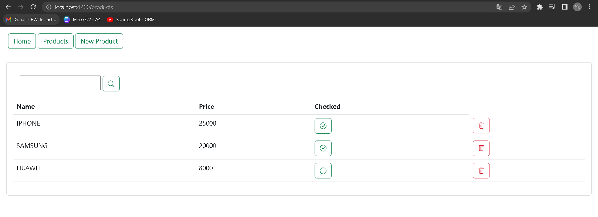
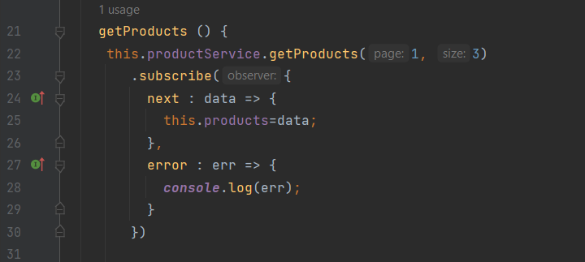
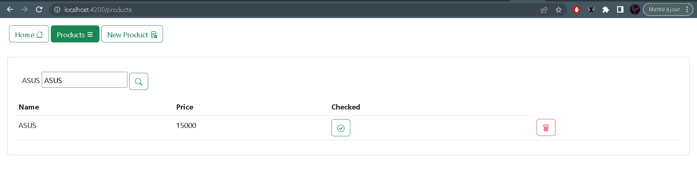
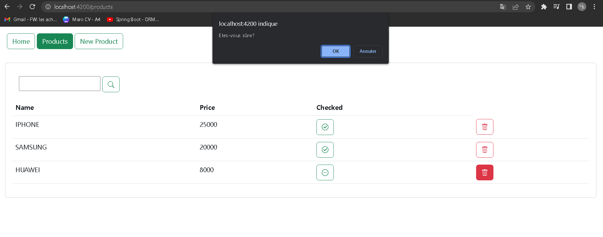
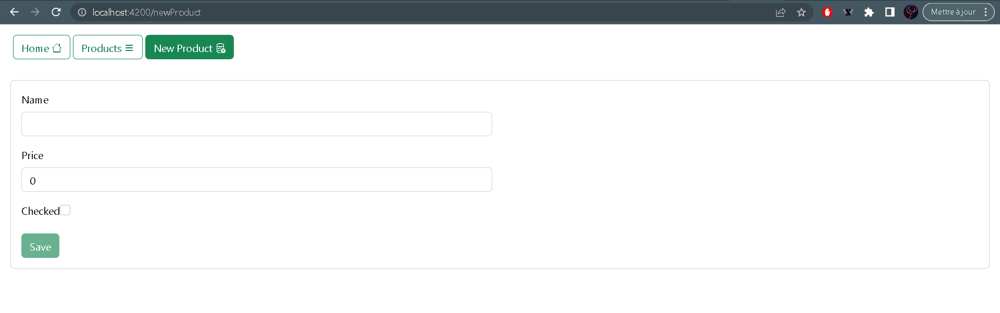
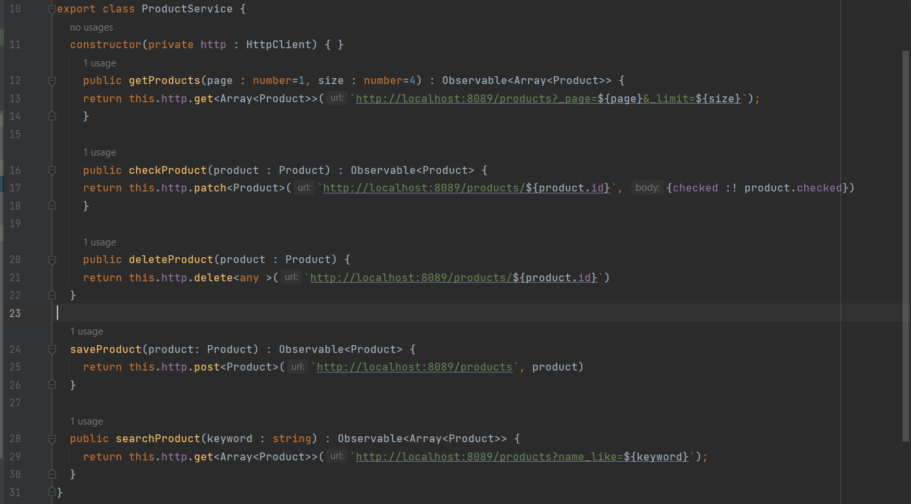

<h1 align="center">Angular-Demo-App</h1>

 
<h4>La liste des produits dans le composant "products" :</h4>

 

<h4>La liste des produits (Pagination) :</h4>

 

<h4>Faire une recherche en utilisant un "Keyword" :</h4>

 

<h4>Suppression d'un produit :</h4>

 
<h4>L'ajout d'un produit dans le composant "new-product" :</h4>

 
<h4>Les services:</h4>

 
